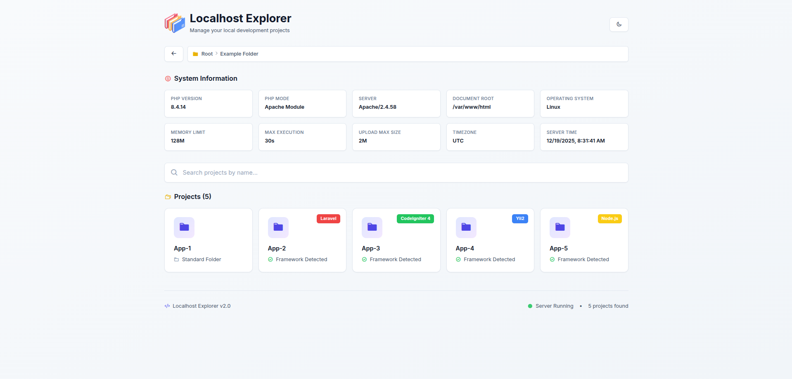
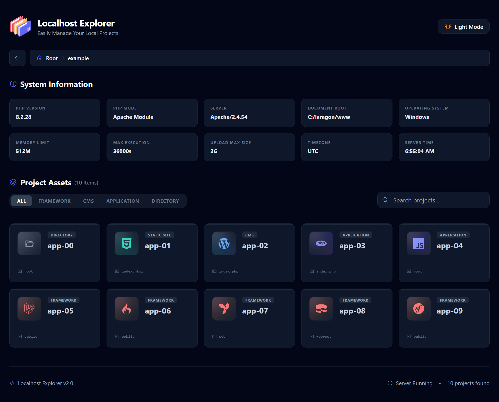

# 🚀 Localhost Explorer




> 🧭 **Clean, modern, and developer-friendly localhost dashboard**
> Stop scrolling through folders. Instantly see, detect, and open your local projects with the correct entry point.

---

## ✨ Why Localhost Explorer?

If you work with **many local projects** (Laravel, Yii2, React, WordPress, etc.), the default Apache index quickly becomes messy and unproductive.

**Localhost Explorer replaces it with a smart dashboard** that:

✅ Detects frameworks automatically  
✅ Routes to the correct entry point  
✅ Looks clean, modern, and fast  
✅ Requires **zero configuration**  

---

## 🔥 Features

### 📁 Project Explorer
- Browse all local project folders (personal, work, experiments)
- Clean **card-based UI** with project grouping

### 🔍 Automatic Framework Detection
Supports popular frameworks out of the box:

- 🟣 **Yii2** → `/web`
- 🔴 **Laravel** → `/public`
- 🟢 **CodeIgniter 4** → `/public`
- 🔵 **Symfony** → `/public`
- 🍰 **CakePHP** → `/webroot`
- 📰 **WordPress** → root
- 📄 Plain PHP projects
- ⚛️ JavaScript projects (React, Vue, Next, Vite, etc.)

### 🚀 Smart Entry Point Routing
Automatically redirects to:
- `public/`
- `web/`
- `webroot/`
- `dist/`
- `build/`

No more guessing URLs.

### 🎨 Developer-Friendly UI
- Modern, responsive design
- Framework badges
- Easy scanning & navigation

### 🔒 Secure by Default
- Prevents directory traversal (`../`)
- Restricts access to document root
- Uses safe `realpath()` validation

### ⚡ Lightweight
- Pure PHP
- No database
- No framework dependency

---

## 🖥️ Preview

> A modern dashboard displaying all local projects with framework badges, system info, and smart routing — replacing the default Apache welcome page.

---

## 📂 Example Folder Structure

```text
/var/www/html
├── index.php          # Localhost Explorer
├── example-folder/
│   ├── app-1/         # Plain PHP / standard folder
│   ├── app-2/         # Laravel project
│   ├── app-3/         # CodeIgniter 4 project
│   ├── app-4/         # Yii2 project
│   └── app-5/         # Node.js / JS project

````

## 📂 Required Folder Structure

> ⚠️ **IMPORTANT**
> The repository **must be placed directly inside Apache document root**.

### Example:

```text
Apache Document Root
(htdocs / www / html)
│
├── localhost-explorer/     ← this repository
│   ├── index.php
│   ├── assets/
│   ├── install.php
│   └── ...
│
├── index.php               ← auto-generated (redirect)
├── .htaccess               ← auto-generated
├── project-a/
├── project-b/
```

---

## ⚙️ Installation (Cross-Platform)

Works on:  
✅ Linux  
✅ Windows (XAMPP / Laragon)  
✅ macOS  
✅ CLI & Browser  

---

### 1️⃣ Clone repository into Apache document root

```bash
cd <APACHE_DOCUMENT_ROOT>
git clone https://github.com/dwiwijaya/localhost-explorer.git
```

Examples:

```text
Linux    : /var/www/html
XAMPP    : C:\xampp\htdocs
Laragon  : C:\laragon\www
```

---

### 2️⃣ Run installer

You can run the installer using **CLI** or **Browser**.

#### Option A — CLI (Recommended)

```bash
cd localhost-explorer
php install.php
```

#### Option B — Browser

```
http://localhost/localhost-explorer/install.php
```

---

### 3️⃣ What the installer does

The installer will:

✅ Detect Apache document root automatically  
  * (parent directory of the repository)*  
  
✅ Create or overwrite:  
  * `index.php`  
  * `.htaccess`

✅ Backup existing files with timestamp  
✅ Redirect Apache root (`/`) to `localhost-explorer/`  

---

### 4️⃣ Generated files

#### `/index.php`

```php
<?php
header('Location: localhost-explorer/');
exit;
```

#### `/.htaccess`

```apache
RewriteEngine On

# Redirect root to localhost-explorer
RewriteRule ^$ localhost-explorer/ [L]
```

---

### 5️⃣ Apache configuration (one-time check)

Make sure Apache prioritizes `index.php`:

```apache
DirectoryIndex index.php index.html index.htm
```

> Usually already set by default in XAMPP / Laragon / Ubuntu.

Reload Apache if needed.

---

### 6️⃣ Open in browser

```
http://localhost/
```

🎉 **Localhost Explorer is now your Apache root dashboard.**

---

## 🧠 How Detection Works

Localhost Explorer scans each folder and detects frameworks based on well-known files:

| Framework | Detection File  | Entry Point         |
| --------- | --------------- | ------------------- |
| Yii2      | `yii`           | `/web`              |
| Laravel   | `artisan`       | `/public`           |
| CI4       | `spark`         | `/public`           |
| Symfony   | `bin/console`   | `/public`           |
| CakePHP   | `bin/cake`      | `/webroot`          |
| WordPress | `wp-config.php` | `/`                 |
| JS Apps   | `package.json`  | `/dist` or `/build` |

📌 If no framework is detected, the folder is treated as a **standard directory**.

---

## 🧩 Supported JavaScript Projects

⚛️ React (CRA, Vite)  
🟢 Vue (Vue CLI, Vite)  
▲ Next.js  
🧪 Vanilla JS  

> If no production build is found, the project will be marked as **JS (dev)**.

---

## 🔐 Security Considerations

🚫 Blocks `../` path traversal  
🔒 Limits access strictly to document root  
🛡️ Uses `realpath()` validation everywhere  

Safe to use as a local development dashboard.

---

## 🚧 Roadmap

Planned improvements:

🔎 Detect running dev servers (3000, 5173, etc.)  
⭐ Favorite / pin projects  
🐍 Python framework support  

---

## 🤝 Contributing

Contributions are very welcome ❤️

1. Fork the repository
2. Create a feature branch
3. Commit your changes
4. Open a pull request

Ideas, issues, and feedback are appreciated.

---

## 📄 License

MIT License — free to use, modify, and share.

---

## 👨‍💻 Author

Built for developers who juggle **many local projects** and want a **clean, productive localhost experience**.

If this tool helps you, consider ⭐ starring the repo!
